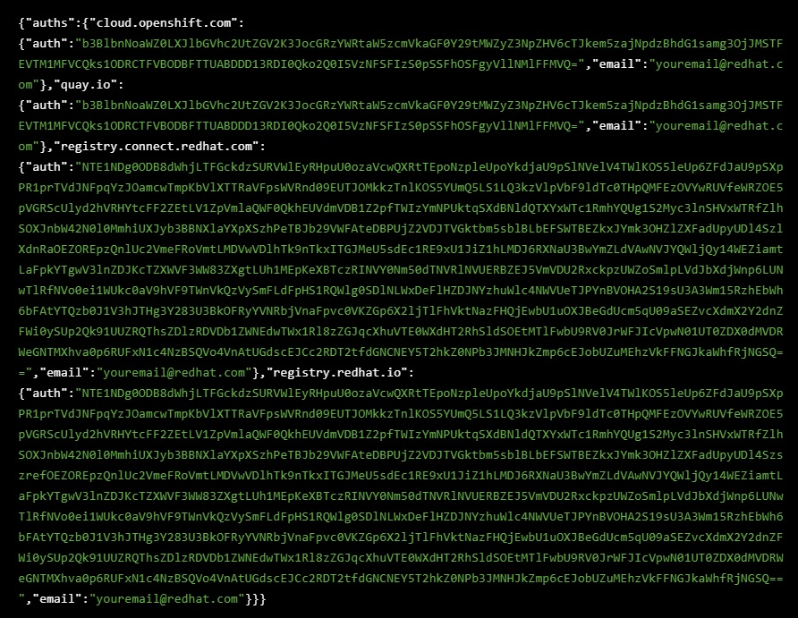

# 1. OCPインストール前の準備  

 1. ssh で環境にログインします。  
    ※ AWS のアカウント情報は環境払い出した後に受信するメールでご確認ください。
 2. sudo コマンドを利用して root 権限を取得します。 
```
$ sudo -i  
# echo ${GUID}
```

 3. AWS の CLI ツールをインストールします。  
```
AWS コマンドラインインターフェースのダウンロード  
  
# curl "https://s3.amazonaws.com/aws-cli/awscli-bundle.zip" -o "awscli-bundle.zip"  
# unzip awscli-bundle.zip  
  
AWS CLI のインストール  
  
# ./awscli-bundle/install -i /usr/local/aws -b /bin/aws  
  
※ AWS CLI の動作確認  

# aws --version  

※ ダウンロードファイルの削除  
  
# rm -rf /root/awscli-bundle /root/awscli-bundle.zip  
```
※ OpenShift インストーラーにはこれらのツールは必要ありませんが、後で使用して資格情報を確認し、作成されたAWSリソースを一覧表示します。  

 4. OpenShift のインストールバイナリをダウンロードします。 
```
# OCP_VERSION=4.1.0
# wget https://mirror.openshift.com/pub/openshift-v4/clients/ocp/${OCP_VERSION}/openshift-install-linux-${OCP_VERSION}.tar.gz
# tar zxvf openshift-install-linux-${OCP_VERSION}.tar.gz -C /usr/bin
# rm -f openshift-install-linux-${OCP_VERSION}.tar.gz /usr/bin/README.md
# chmod +x /usr/bin/openshift-install
```

 5. OpenShift のコマンドラインツール oc ツールをダウンロードします。  
```
# wget https://mirror.openshift.com/pub/openshift-v4/clients/ocp/${OCP_VERSION}/openshift-client-linux-${OCP_VERSION}.tar.gz
# tar zxvf openshift-client-linux-${OCP_VERSION}.tar.gz -C /usr/bin
# rm -f openshift-client-linux-${OCP_VERSION}.tar.gz /usr/bin/README.md
# chmod +x /usr/bin/oc
```

 6. OpenShift インストーラーと CLI の存在を確認します。  
```
# ls -l /usr/bin/{oc,openshift-install}
```
出力イメージ
```
-rwxr-xr-x. 2 root root  76593328 May 19 23:53 /usr/bin/oc*
-rwxr-xr-x. 1 root root 216764576 May 22 03:22 /usr/bin/openshift-install*
```
 7. bash の設定を行います。  
```
# oc completion bash >/etc/bash_completion.d/openshift
```
 8. "ctrl + D" で root から抜けます。
 9.　AWS にアクセスするための認証キーを credentials ファイルに記述します。  
     ※必要な認証キーはメールに記載されていますのでご確認ください。  
       <YOURACCESSKEY> 及び、<YOURSECRETKEY> の部分をご自身のものに変更ください  

```
$ export AWSKEY=<YOURACCESSKEY>
$ export AWSSECRETKEY=<YOURSECRETKEY>
$ export REGION=us-east-2

$ mkdir $HOME/.aws
$ cat << EOF >>  $HOME/.aws/credentials
[default]
aws_access_key_id = ${AWSKEY}
aws_secret_access_key = ${AWSSECRETKEY}
region = $REGION
EOF 
```

 10. 認証情報がきちんと設定されていることを確認します。  
```
aws sts get-caller-identity
```

 11. https://cloud.openshift.com/clusters/install にご自身のカスタマーポータルアカウントでログインします。  
 12. AWS をクリックします。  
 13. Installer-Provisioned-Infrastructure をクリックします。  
 14. Pull Secret を見つけ、Copy Pull Secret をクリックし、クリップボードに内容をコピーし、テキストファイルに張り付けて保存します。  
 15. 内容はこんな感じです。  
   
       

 16. ファイルは閉じるか最小化して、また、コマンドラインに戻り、ssh のキーペアを作成します。
 ```
 ssh-keygen -f ~/.ssh/cluster-${GUID}-key -N ''
 ```
 
